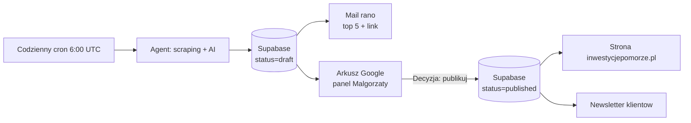

# Agent naborow - InwestycjePomorze.pl

> Codzienny automat, ktory rano przeglada portale z naborami funduszy unijnych, KPO i regionalnych, wzbogaca kazdy nowy nabor streszczeniem i tagami przez AI, zapisuje do bazy Supabase, wysyla mail i synchronizuje arkusz Google.

## Spis tresci

- [Co to jest i co robi](#co-to-jest-i-co-robi)
- [Dla Malgorzaty - jak korzystac z panelu](#dla-malgorzaty---jak-korzystac-z-panelu)
- [Dla Pawla - jak utrzymywac](#dla-pawla---jak-utrzymywac)
- [Pierwsze uruchomienie](#pierwsze-uruchomienie)
- [Struktura projektu](#struktura-projektu)
- [Roadmapa](#roadmapa)

---

## Co to jest i co robi

Codziennie o **6:00 UTC (7:00/8:00 PL)** GitHub Actions uruchamia agenta. Agent:

1. **Wchodzi** na portale wymienione w `sources.yaml` (m.in. funduszeunijne.gov.pl, PARP, NCBR, FE Pomorze, KPO, granty.pl).
2. **Wyciaga** liste naborow (selektory CSS lub - jesli zawioda - ekstrakcja przez AI).
3. **Sprawdza**, ktore sa nowe wzgledem bazy Supabase.
4. **Dla kazdego nowego** otwiera strone szczegolow i prosi GPT-4o-mini o:
   - 2-3 zdaniowe streszczenie po polsku
   - tagi (program, region, beneficjent, branza)
   - ocene dopasowania do profilu InwestycjePomorze.pl (0-100)
5. **Zapisuje** do Supabase ze statusem `draft` (nieopublikowany).
6. **Synchronizuje** arkusz Google "Nabory - panel Malgorzaty" (zakladka "Nowe nieprzejrzane").
7. **Wysyla mail** do `gosiagrzyska@gmail.com` z top 5 najwyzej dopasowanych + linkiem do panelu.
8. **Czeka** na decyzje w arkuszu (kolumna Decyzja: `publikuj` / `odrzuc`).
9. Po decyzji `publikuj` -> nabor trafia do widoku publicznego (etap 4: na strone firmy + etap 5: do newslettera klientow).



---

## Dla Malgorzaty - jak korzystac z panelu

### Codziennie rano

1. **Sprawdz mail** od `agent@inwestycjepomorze.pl` (lub fallback `onboarding@resend.dev`). Tytul: `[Nabory DD.MM] X nowych naborow`.
2. **Top 5** widzisz w mailu. Mozesz je zaakceptowac/odrzucic od razu z arkusza.
3. **Pelna lista** jest w arkuszu Google (link na koncu maila albo w zakladkach przegladarki).

### W arkuszu Google

Otworz zakladke **"Nowe nieprzejrzane"**. Kazdy wiersz to jeden nabor.

Najwazniejsza kolumna: **Decyzja** (kolumna C). Wpisz w niej:

- **`publikuj`** - nabor jest dobry, dopisuje sie do bazy publicznej (kiedys zasili strone i newsletter klientow)
- **`odrzuc`** - nabor nie pasuje, ukrywa go z aktualnej listy

Decyzje sa synchronizowane raz dziennie (po nocnym runie). Mozesz tez recznie wymusic synchronizacje - daj znac Pawlowi.

### Jak czytac kolumne "Match" (dopasowanie)

| Match | Znaczenie |
|-------|-----------|
| 90-100 | Idealny - bezposrednio dla naszych klientow, koniecznie sprawdz |
| 70-89 | Bardzo dobry - warto przejrzec |
| 50-69 | Sredni - moze sie przydac dla niektorych klientow |
| 30-49 | Marginalny - jesli masz czas |
| 0-29 | Slaby - mozna pominac |

Score nie jest absolutny - to wskazowka od AI, nie wyrocznia. Twoje doswiadczenie jest wazniejsze.

### Jesli AI sie myli

Jesli widzisz, ze AI uparcie zle ocenia jakies nabory (np. zaniza score dla NGO, bo profil jest zbyt MSP-centryczny), poproś Pawla o aktualizacje pliku `profile.md`. Tam siedzi kontekst, ktory AI dostaje przy ocenie.

### Jak dodac nowa strone do monitorowania

Najprosciej: napisz do Pawla "dodaj agentowi strone X". On to wpisze do `sources.yaml` i sprawdzi, czy dziala.

Jesli chcesz sprobowac sama:

1. Otworz `sources.yaml` w GitHubie (przegladarka, edycja online wystarczy).
2. Skopiuj jeden z istniejacych blokow i podmien:
   - `name`: czytelna nazwa
   - `url`: adres listy naborow
   - `fetcher`: zostaw `playwright` (najbezpieczniejsze)
   - `extractor`: zostaw `llm` (najprostsze, AI sam wyciagnie liste)
3. Commit -> agent zacznie monitorowac od nastepnego dnia.

Jesli zrodlo zacznie sie pojawiac w sekcji "Zrodla z bledem" w mailu - Pawel je naprawi.

---

## Dla Pawla - jak utrzymywac

### Codzienne zdrowe operacje

- Mail przychodzi -> wszystko ok.
- Sekcja "Zrodla z bledem" w mailu -> sprawdz logi w GitHub Actions (https://github.com/TWOJ_USER/nabory/actions). Klikij ostatni run -> step "Run agent" -> tam zobaczysz selektory ktore zawiodly.
- Jesli zrodlo dlugo nie dziala -> przelacz w `sources.yaml` na `extractor: llm` (omija selektory CSS, AI radzi sobie z wiekszoscia stron).

### Aktualizacja zrodel

```yaml
- name: "Nowe zrodlo"
  url: "https://example.com/nabory"
  fetcher: playwright   # http | playwright | rss | pdf
  extractor: llm        # css | llm
  active: true
  notes: "Co warto pamietac o tym zrodle"
```

Po edycji `sources.yaml` wpisuje sie do bazy Supabase (tabela `sources`) automatycznie przy nastepnym runie.

### Lokalne uruchomienie do debugowania

Patrz `SETUP.md` sekcja "Lokalne uruchomienie".

```powershell
# Tryb dry-run (nic nie zapisuje, nie wysyla maila)
$env:DRY_RUN="yes"; python -m nabory.main

# Pelny run (lokalny)
python -m nabory.main
```

### Manualne uruchomienie z GitHub Actions

Wejdz w **Actions -> Daily naboru run -> Run workflow**. Mozesz wybrac `dry_run=yes` zeby nie zapisywal i nie wysylal maila.

### Synchronizacja decyzji z arkusza w trybie ad-hoc

Standardowo synchronizacja Sheet -> Supabase odbywa sie automatycznie po nocnym runie. Jesli chcesz wymusic ja od reki:

```powershell
python -m nabory.sinks.sheets sync-decisions
```

### Co jesli OpenAI/Resend zaczna kosztowac wiecej niz oczekuje?

- **OpenAI**: w `OPENAI_MODEL` mozna przelaczyc model. `gpt-4o-mini` jest tani (~$0.15/mln tokenow). `gpt-5-mini` mialby lepsze rozumienie kontekstu, ale drozej.
- **Resend**: darmowe 100 maili/dzien. Dla pojedynczego maila dziennie - mamy 100x zapas.
- **Limit enrichmentow**: `MAX_ENRICH_PER_RUN=80` w `.env`/Secrets - powyzej tej liczby nowych naborow w jednym runie reszta poczeka do nastepnego dnia (chroni przed niespodziewanym wybuchem kosztow).

---

## Pierwsze uruchomienie

Patrz **[SETUP.md](SETUP.md)** - instrukcja krok-po-kroku po polsku (~30-45 min jednorazowo).

---

## Struktura projektu

```
nabory/
|-- .github/workflows/daily.yml      # cron 6:00 UTC + workflow_dispatch
|-- .env.example                     # szablon sekretow
|-- .gitignore
|-- pyproject.toml + requirements.txt
|-- profile.md                       # profil Malgorzaty - kontekst dla AI
|-- sources.yaml                     # lista zrodel - edytowalna recznie
|-- README.md                        # ten plik
|-- SETUP.md                         # przewodnik instalacyjny
|-- supabase/
|   |-- migrations/0001_init.sql     # schemat bazy
|   `-- seed.sql                     # tagi domyslne
|-- src/nabory/
|   |-- main.py                      # orkiestrator
|   |-- config.py                    # ladowanie konfiguracji
|   |-- db.py                        # klient Supabase
|   |-- enrich.py                    # LLM enrichment
|   |-- models.py                    # Pydantic modele
|   |-- logging_setup.py
|   |-- fetchers/                    # http/playwright/rss/pdf
|   |-- extractors/                  # css/llm/rss
|   `-- sinks/                       # mail/sheets
`-- docs/                            # roadmapa, integracje
```

---

## Roadmapa

- [x] **Etap 0** - Infrastruktura (SETUP.md, sekrety)
- [x] **Etap 1** - Szkielet pipeline + 1 zrodlo + mail
- [x] **Etap 2** - Pozostale zrodla (PARP, NCBR, FE Pomorze, KPO, granty.pl)
- [x] **Etap 3** - Panel akceptacji w Google Sheets
- [ ] **Etap 4** - Integracja sekcji "Nabory" na inwestycjepomorze.pl (`docs/etap-4-integracja.md`)
- [ ] **Etap 5** - Newsletter klientow (segmentowany) (`docs/etap-5-newsletter.md`)
- [ ] **Etap 6** - Opcjonalnie: RAG dla Asystenta AI, Telegram bot, dashboard (`docs/etap-6-roadmapa.md`)
