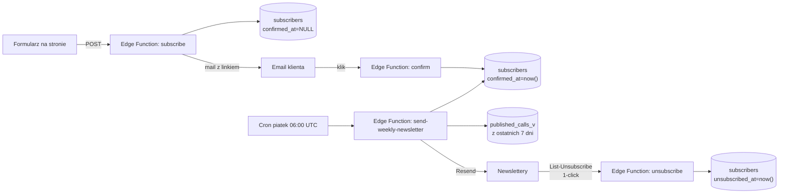

# Etap 5 - Newsletter klientow

## Cel

Cotygodniowy automatyczny newsletter dla klientow zapisanych przez formularz na inwestycjepomorze.pl. Segmentowany po preferencjach (Fundusze UE / KPO / Programy regionalne). Dziala w pelni RODO-zgodnie: double opt-in + jeden klik wypisu + List-Unsubscribe header.

## Architektura



Cztery Edge Functions w `supabase/functions/`:

- `subscribe` - przyjmuje formularz, zapisuje subskrybenta z `confirmed_at=NULL`, wysyla mail z linkiem potwierdzenia.
- `confirm` - klikniecie linku w mailu -> ustawia `confirmed_at=now()` -> uzytkownik zaczyna dostawac newsletter.
- `unsubscribe` - jeden klik -> `unsubscribed_at=now()`, koniec.
- `send-weekly-newsletter` - cron piatkowy, segmentuje, wysyla.

## Wdrozenie krok-po-kroku

### Krok 1. Sprawdzenie/utworzenie tabeli `subscribers`

Tabela jest juz w migracji `supabase/migrations/0001_init.sql`. Jesli wykonales SETUP.md - juz istnieje.

### Krok 2. Deploy Edge Functions

```bash
# W katalogu nabory/
supabase login
supabase link --project-ref YOUR_PROJECT_REF

supabase functions deploy subscribe --no-verify-jwt
supabase functions deploy confirm --no-verify-jwt
supabase functions deploy unsubscribe --no-verify-jwt
supabase functions deploy send-weekly-newsletter
```

### Krok 3. Konfiguracja zmiennych srodowiskowych Edge Functions

W Supabase Dashboard -> **Project Settings -> Edge Functions -> Environment Variables**:

| Zmienna | Wartosc |
|---------|---------|
| `RESEND_API_KEY` | Ten sam co w GitHub Actions |
| `MAIL_FROM` | `Newsletter InwestycjePomorze <newsletter@inwestycjepomorze.pl>` |
| `MAIL_FROM_NEWSLETTER` | (opcjonalnie) - jesli chcesz innego "From" dla newsletterow niz dla potwierdzen |
| `PUBLIC_BASE_URL` | `https://inwestycjepomorze.pl` |
| `CRON_SECRET` | losowy ciag (np. `openssl rand -hex 32`) - chroni cron endpoint |

> `SUPABASE_URL` i `SUPABASE_SERVICE_ROLE_KEY` sa AUTOMATYCZNIE udostepnione w Edge Functions.

### Krok 4. Konfiguracja crona w Supabase

Supabase Dashboard -> **Database -> Cron Jobs** (lub przez SQL Editor):

```sql
-- Wymaga rozszerzenia pg_cron + pg_net (sa domyslnie dostepne na Supabase)
select cron.schedule(
    'weekly-newsletter',
    '0 6 * * 5',  -- piatki 06:00 UTC = 07:00/08:00 PL
    $$
    select net.http_post(
        url := 'https://YOUR_PROJECT_REF.supabase.co/functions/v1/send-weekly-newsletter',
        headers := jsonb_build_object(
            'x-cron-secret', 'WPISZ_TUTAJ_CRON_SECRET',
            'Content-Type', 'application/json'
        )
    );
    $$
);
```

### Krok 5. Integracja formularza na stronie

W repo strony `inwestycjepomorze.pl`:

1. Skopiuj [`integration/website/newsletter-form.js`](../integration/website/newsletter-form.js) do `static/js/`.
2. Dolacz do strony tuz przed `</body>`:
   ```html
   <script src="/js/newsletter-form.js" defer></script>
   ```
3. (Opcjonalnie) usun istniejaca obsluge formularza newsletter (jesli byla na EmailJS lub Netlify Forms) -> teraz idzie przez Edge Function.

> Formularz juz ma `id="newsletterForm"` i checkboxy `name="interests"` z odpowiednimi wartosciami - skrypt podpina sie automatycznie.

### Krok 6. Test end-to-end

1. Zapisz sie sam ze swoim mailem na stronie.
2. Sprawdz, czy dotarl mail z linkiem potwierdzenia.
3. Klijnij link -> powinno przekierowac na ekran "Subskrypcja potwierdzona".
4. Sprawdz w Supabase tabela `subscribers` - powinien byc twoj wpis z `confirmed_at`.
5. Wymus testowa wysylke crona:
   ```bash
   curl -X POST https://YOUR_PROJECT_REF.supabase.co/functions/v1/send-weekly-newsletter \
     -H "x-cron-secret: TWOJ_SEKRET"
   ```
6. Sprawdz, czy dostales newsletter (oczywiscie tylko jesli sa published calls z ostatniego tygodnia).
7. Sprawdz link "Wypisz sie" -> powinien dac potwierdzenie + wpis `unsubscribed_at` w bazie.

## RODO i compliance

- **Podstawa prawna**: art. 6 ust. 1 lit. a RODO (zgoda) + art. 9 (zgoda explicit).
- **Double opt-in**: zapis nie aktywuje subskrypcji, dopiero klik w mailu (`confirmed_at`) - dowod, ze adres jest poprawny i nalezy do osoby.
- **Wypis jednym klikiem**: `unsubscribe_token` ma 24 bajty losowe, link nie wymaga logowania, jeden POST/GET wystarczy.
- **List-Unsubscribe header** + `List-Unsubscribe-Post: List-Unsubscribe=One-Click` - wymog Gmaila/Yahoo dla dostarczalnosci do skrzynek od 2024-02.
- **Polityka prywatnosci**: link w stopce kazdego maila (`/polityka-prywatnosci`). Upewnij sie, ze ten URL na inwestycjepomorze.pl istnieje i ma odpowiedni tekst (jesli nie - dorobimy).
- **Retention**: aktualnie nie kasujemy danych po wypisie (tylko ustawiamy `unsubscribed_at`). To pozwala uniknac ponownych wysylek przy reimporcie. Jesli klient zazada usuniecia wedlug RODO art. 17 - DELETE wpisu z `subscribers` jest legitymalny.

## Limit Resend free tier

- 100 maili/dzien, 3000/mies.
- Newsletter raz w tygodniu = 4 wysylki/mies. Przy 600 subskrybentach to 2400 maili/mies - mieszczamy sie.
- Powyzej 750 subskrybentow trzeba przejsc na Resend Pro ($20/mies, 50 000 maili).

## Co jest niezbedne do produkcyjnego startu

- [ ] Domena `inwestycjepomorze.pl` zweryfikowana w Resend (SPF + DKIM + DMARC).
- [ ] Strona `/polityka-prywatnosci` na inwestycjepomorze.pl - aktualizacja o info o newsletterze.
- [ ] Strona `/regulamin-newsletter` (opcjonalnie, zalecane przez prawnika).
- [ ] Test wysylki z 5-10 zaproszonymi osobami przed publicznym uruchomieniem.

## Ulepszenia w przyszlosci

- **Personalizowany content**: dla profilu klienta (np. brane), nie tylko po kategoriach.
- **A/B test subjectow**: Resend ma API do tego.
- **Statystyki otwarc/klikniec**: Resend daje webhook, mozemy zapisywac do osobnej tabeli.
- **Re-engagement campaign**: jesli ktos nie kliknie zadnego maila przez 3 miesiace - osobny mail "Czy nadal chcesz dostawac?".
